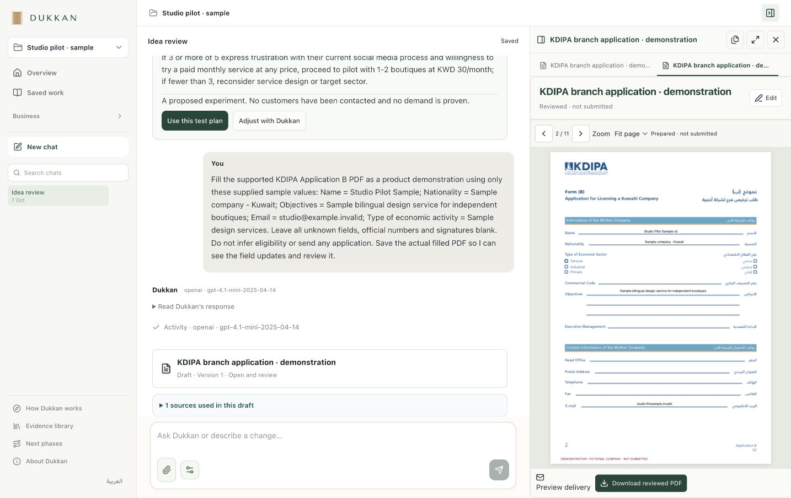

# Dukkan | دُكّان

A Kuwait-focused business workspace that connects an idea to research, tests, decisions, costs and reviewable documents.

Dukkan keeps the founder’s context and evidence together. Its agent proposes changes; the founder reviews and saves them. Supported PDFs have immutable versions and exact-hash review. Hosted API inference works independently of a Codex subscription.



## What works

| Capability | Current status |
| --- | --- |
| Business brief, assumptions, evidence, tests and decisions | Implemented; browser storage with backup/recovery |
| Idea critique, validation plans and cost drafts | Real API acceptance passed against the private, attributed evidence snapshot |
| Kuwait market and official-source retrieval | Implemented; captured research snapshot is **not distributed** in this repository |
| KWD costs, scenarios, records, finance CSV review and charts | Implemented; estimates/simulations remain distinct from recorded actuals |
| Sales, people and operations | Typed records, reviewable agent proposals, revisions and archive/restore |
| Official PDF preparation | KDIPA Application B live field preview, download, supported AcroForm filling, revisions and human review; no filing or signatures |
| Conversations, documents and attachments | Local SQLite persistence; no new hosted multi-user service claim |
| Email | Draft/review adapter and reviewed-document delivery preview; a sending account is not connected in this release |
| English and Arabic interface | Implemented; complete linguistic/accessibility audit remains open |
| Marketplace, investors, marketing and integrations | [Phase 2](docs/PHASE-2.md), separately planned with 13 interactive design previews |

This is a working local prototype. Prepared records do not establish completed commercial actions or legal eligibility. Example businesses and their operating data are fictional.

## Why this workflow matters

Local evidence is connected to a persistent business context, then to tests, decisions, records and documents. Decisions retain their evidence and documents retain their versions. The useful distinction is that continuity and traceability. A defensible market advantage still needs comparison with general chatbots, templates and advisers.

## Run from a GitHub clone

The GitHub repository contains source code; it is not a running website. To run the complete app, install [Node.js 24 or later](https://nodejs.org/), clone this repository, and open a terminal in the cloned folder. No Python installation, Codex login or local AI model is needed to launch it.

Run setup once:

```sh
npm run setup
```

This installs the backend and frontend dependencies, then downloads the official PDF template and verifies its published checksum. Copy `assis-backend/.env.example` to `assis-backend/.env.local`, then add your OpenAI API key to that local file:

```sh
cp assis-backend/.env.example assis-backend/.env.local
```

The example uses `gpt-4.1-mini`; `gpt-4o-mini` is also supported. Keep `.env.local` private. Set `OPENAI_MAX_DAILY_USD=0.50` to enforce a conservative daily reservation cap before OpenAI chat requests are sent. Failed or ambiguous requests retain their reservation; this cap does not cover separate speech API calls. The launcher checks only whether the required key is present and never prints it. You can use OpenRouter instead by setting `DIKAN_PROVIDER=openrouter` and filling in its key and model settings. Direct OpenAI access avoids the extra OpenRouter account and funding step; model token pricing is unchanged. Set `DIKAN_PROVIDER=none` to use records and documents without AI.

Check the local configuration without starting servers or contacting a model:

```sh
npm run check
```

Start Dukkan with one command:

```sh
npm start
```

The launcher builds the frontend, starts the local backend on port 8789, and prints the app URL: [http://127.0.0.1:8788/workspace/](http://127.0.0.1:8788/workspace/). The default is a new business workspace. To explore fictional sample data, open [the sample business](http://127.0.0.1:8788/workspace/?example=pearl-delta&view=home). Both servers listen on this computer only. Press Ctrl+C in the terminal to stop them. If either port is already occupied, stop the other local instance before retrying.

Opening a downloaded HTML file shows only the static interface. Chat, saved conversations and document operations need the backend. GitHub Pages can host static files, but it cannot run this Node backend or keep an API key private. A deployed website needs a separately configured backend and secure server-side key storage.

### Research setup

The public source register contains attribution and original URLs in [SOURCE-REGISTER.json](docs/SOURCE-REGISTER.json). Full reports, extracted passages and indexed corpora are excluded because public access does not establish redistribution rights.

The clean public clone does not include the private research corpus. Core records, manual work and native PDF preparation work without it; source-backed research, critique and planning require the matching authorised `knowledge/` snapshot. Install it locally from a snapshot you have permission to use, preserving manifests, extracts and hashes. The backend reports when it is absent or changed. Retrieved passages carry provenance, but model prose still requires human checking: a valid citation ID does not establish that its claim is supported. Do not disable hash verification. See [architecture and data boundaries](docs/ARCHITECTURE.md). The full local acceptance script is `assis-backend/test/api-release-live.ts`; it also requires that snapshot.

## Reproducible API demonstration

```sh
cd assis-backend
npm run verify:release
```

This opt-in test uses a fresh fictional store, caps inference at twelve requests, asks the real API for a simulated quote and a supported PDF, checks revisions/review and restarts the store to verify persistence. It does not read user businesses or submit anything. API usage is billable within the configured caps. A failure is reported as a failure, with no scripted success fallback.

The direct OpenAI demonstration passed on 7 October 2026 with four model requests at an estimated USD 0.0044108. That figure is calculated from reported token use, not an account billing statement. A separate fixed ten-query evaluation on the authorised local corpus scored 9/10 for answer correctness and 4/10 for complete exact-passage citation support. This small set does not establish production reliability. The broader verified walkthrough and precise evidence boundaries are in [DEMO.md](docs/DEMO.md). Screenshots show the actual app with fictional data, not a hosted service or a live government transaction.

## Project checks

```sh
npm test --prefix assis-backend
npm test --prefix assis-workspace
npm run build --prefix assis-workspace
```

Public checks passed: 69 backend tests, 129 frontend tests, the launcher HTTP test and a production build. They cover providers, record validation, context limits, draft repair, PDF versions, email drafts and frontend behaviour. The full local backend suite passed 166 tests. `npm run test:full --prefix assis-backend` additionally requires the original attributed research snapshot and fixtures. API checks are opt-in. [GitHub Actions template](docs/github-checks.yml) contains the same public checks; copy it to `.github/workflows/checks.yml` when publishing with a login authorised for workflows. Automatic GitHub CI is not enabled by this release.

## Hosting

GitHub stores and reviews this source. GitHub Pages alone cannot run the Node agent backend, keep API keys secret or provide SQLite persistence. A public deployment needs a server runtime, persistent storage, authentication and tenant isolation. The current server accepts loopback connections only. Deployment and team/cloud operation have separate acceptance gates in Phase 2.

## Data and publication

No credentials, private database, user attachments, private assessment form, team contact details or full third-party research sources are included. The official PDF is downloaded locally from its original publisher and checksum-checked. Keep generated/private files ignored. No open-source licence grant has been selected for this project; dependency licences remain with their respective authors.
