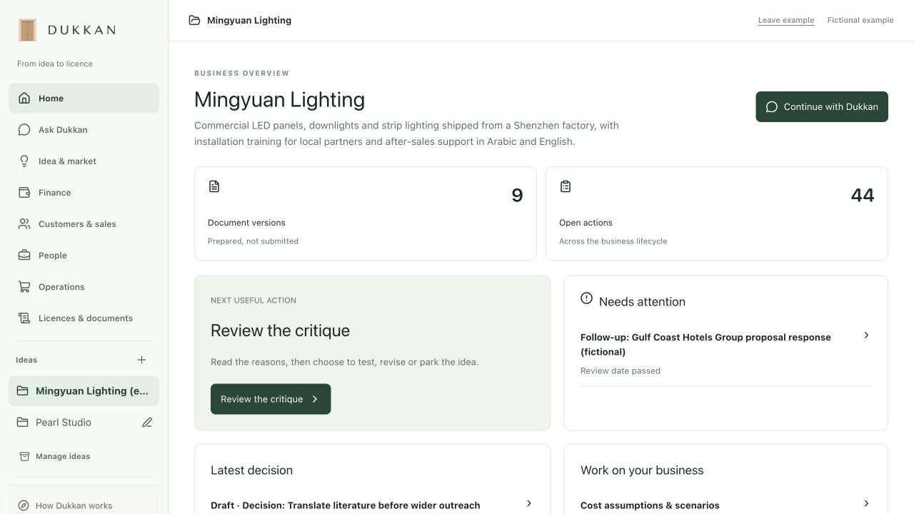

# Dukkan | دُكّان

A Kuwait-focused business workspace that connects an idea to research, tests, decisions, costs and reviewable documents.

Dukkan keeps the founder’s context and evidence together. Its agent proposes changes; the founder reviews and saves them. Supported PDFs have immutable versions and exact-hash review. Hosted API inference works independently of a Codex subscription.



## What works

| Capability | Current status |
| --- | --- |
| Business brief, assumptions, evidence, tests and decisions | Implemented; browser storage with backup/recovery |
| Idea critique, validation plans and cost drafts | Real API acceptance passed against the private, attributed evidence snapshot |
| Kuwait market and official-source retrieval | Implemented; captured research snapshot is **not distributed** in this repository |
| KWD costs, scenarios, records, finance CSV review and charts | Implemented; estimates/simulations remain distinct from recorded actuals |
| Sales, people and operations | Typed records, reviewable agent proposals, revisions and archive/restore |
| Official PDF preparation | KDIPA Application B download, supported AcroForm filling, revisions and human review; no filing or signatures |
| Conversations, documents and attachments | Local SQLite persistence; no new hosted multi-user service claim |
| Email | Draft/review adapter; a sending account is not connected in this release |
| English and Arabic interface | Implemented; complete linguistic/accessibility audit remains open |
| Marketplace, investors, marketing and integrations | [Phase 2](docs/PHASE-2.md), separately planned |

This is a working local prototype. Prepared records do not establish completed commercial actions or legal eligibility. Example businesses and their operating data are fictional.

## Why this workflow matters

Local evidence is connected to a persistent business context, then to tests, decisions, records and documents. Decisions retain their evidence and documents retain their versions. The useful distinction is that continuity and traceability. A defensible market advantage still needs comparison with general chatbots, templates and advisers.

## Run locally

Requires Node.js 24+, Python 3 and npm. No local model or Codex login is required.

```sh
npm ci --prefix assis-backend
npm ci --prefix assis-workspace
node scripts/setup-assets.mjs
cp assis-backend/.env.example assis-backend/.env.local
```

Set the backend-only API key in `.env.local`, protect it with `chmod 600`, and choose an exact OpenRouter model. The example uses `deepseek/deepseek-v4-flash`, with maximum input/output rates of USD 1/3 per million tokens, 4,096 output tokens, 60,000 input bytes and 100 requests per day. A rejected or failed request does not fall back to Codex or another provider. Provider availability and prices are checked at runtime.

Start two terminals:

```sh
# Terminal 1
cd assis-backend
npm run start:configured
```

```sh
# Terminal 2, from the repository root
npm run build --prefix assis-workspace
python3 -m http.server 8788 --bind 127.0.0.1 --directory assis-mvp
```

Open [Dukkan locally](http://127.0.0.1:8788/workspace/?example=pearl-delta&view=home). Keep one frontend builder and one backend instance. Stop either process with Ctrl+C; use Stop in chat to cancel a turn.

### Research setup

The public source register contains attribution and original URLs in [SOURCE-REGISTER.json](docs/SOURCE-REGISTER.json). Full reports, extracted passages and indexed corpora are excluded because public access does not establish redistribution rights.

Record proposals and native PDF filling work without that corpus. Research, critique and source-backed planning require the matching authorised local `knowledge/` snapshot. Install it locally from a snapshot you have permission to use, preserving manifests, extracts and hashes. The backend fails visibly when it is absent or changed. Do not disable hash verification. See [architecture and data boundaries](docs/ARCHITECTURE.md). The full local acceptance script is `assis-backend/test/api-release-live.ts`; it requires that snapshot.

## Reproducible API demonstration

```sh
cd assis-backend
npm run verify:release
```

This opt-in test uses a fresh fictional store, caps inference at twelve requests, asks the real API for a simulated quote and a supported PDF, checks revisions/review and restarts the store to verify persistence. It does not read user businesses or submit anything. API usage is billable within the configured caps. A failure is reported as a failure, with no scripted success fallback.

The broader verified walkthrough and precise evidence boundaries are in [DEMO.md](docs/DEMO.md). Screenshots show the actual app with fictional data, not a hosted service or a live government transaction.

## Project checks

```sh
npm test --prefix assis-backend
npm test --prefix assis-workspace
npm run build --prefix assis-workspace
```

Public checks cover providers, record validation, context limits, PDF versions, email drafts and frontend behaviour. `npm run test:full --prefix assis-backend` additionally requires the original attributed research snapshot and fixtures. API checks are opt-in. [GitHub Actions template](docs/github-checks.yml) contains the same public checks; copy it to `.github/workflows/checks.yml` when publishing with a login authorised for workflows. Automatic GitHub CI is not enabled by this release.

## Hosting

GitHub stores and reviews this source. GitHub Pages alone cannot run the Node agent backend, keep API keys secret or provide SQLite persistence. A public deployment needs a server runtime, persistent storage, authentication and tenant isolation. The current server accepts loopback connections only. Deployment and team/cloud operation have separate acceptance gates in Phase 2.

## Data and publication

No credentials, private database, user attachments, private assessment form, team contact details or full third-party research sources are included. The official PDF is downloaded locally from its original publisher and checksum-checked. Keep generated/private files ignored. No open-source licence grant has been selected for this project; dependency licences remain with their respective authors.
