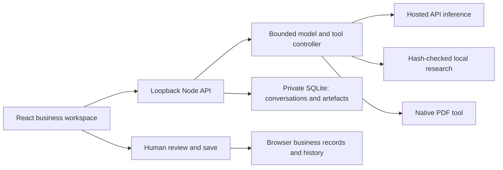

# Architecture

`assis-workspace` is React/TypeScript/Vite. `assis-backend` is Node/TypeScript with a scoped tool dispatcher. `shared/lifecycle.ts` validates business records. Python readers verify and retrieve attributed local passages; market reports and official guidance remain separate.

The model receives a bounded, explicitly incomplete context preview. The full snapshot remains the authoritative validator input. A proposal cannot overwrite stale business state or silently mark an order, hire or submission completed. API requests have token, byte, count and price caps. Native PDF revisions preserve original bytes; review binds to the exact hash.

Business records use browser storage in the local product; conversations, draft documents and attachments use backend SQLite. The fictional example uses session storage. These are separate persistence boundaries. Optional cloud modules exist in source, but deployment, accounts and cross-device acceptance are not claimed here.

The public release intentionally excludes `knowledge/**/raw`, extracted source text and generated corpora. Existing `knowledge-pins.json` records the exact full research snapshot used for acceptance. Installing a different snapshot needs a deliberate, reviewed manifest/pin update and retrieval tests. The public API demo avoids retrieval so it can run without redistributing that material.

The backend is loopback-only and is not safe to expose by changing its bind address alone. Production needs authenticated API access, per-user isolation, secret management, backups, retention decisions, monitoring and a persistent host. Browser or Gmail tools belonging to Codex are not product integrations.
